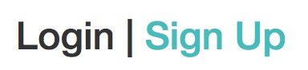
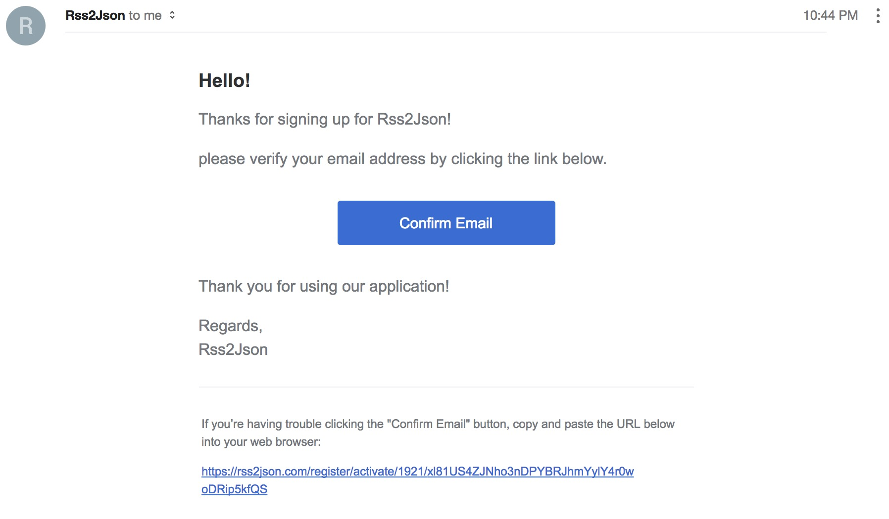
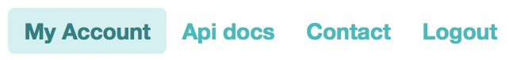

# Generating an API key
As the RSS dialog requires you to enter an API key, this guide will show you how to generate one.

**UPDATE:** I am currently planning to provide the API key to the `FeedDialog`. The following instructions below will soon be outdated.

---

## Instructions
1. Go to [this page](https://rss2json.com) and look for the navbar on the top right corner of the website, as shown here:

   

2. On the navbar, click on the `Login` button, which will lead you to the login page. Click on the `Sign up` link, as seen below:

   

3. On the page, fill in the input fields with your email address and password and click `Register` once you are done filling up.
4. After registering, check your email for the verification for your account. It should look something like this (with the subject header **Welcome to Rss2Json! Please Confirm Your Account**):

   
5. Click on the `Confirm Email` button to continue. It should redirect you to the login page. If the button doesm't work, click on the manual link as stated in the email.
6. Fill up the form fields with the same particulars you filled up on Step 3. 
7. Once you're logged in, click on `My account` on the top right of the corner of the website (as seen here):
   
8. When you're at the page, click on `API key` (as seen here):
   
9. Lastly, click/ tap on the input field and copy it to the clipboard. Then head back to the [website](https://chan4077.github.io/angular-rss-reader) and fill up the API key section in the feed dialog.

You're done!

# Alternative method
Alternatively, here's one of two API keys that you can use:
- `mvbgzzsa1lyk5nbtmld2prhkbjdoywklbc56gepn`
- `tu3yxir4ugxckcldog9wtnvisrqhmy8qv7vuf7pg`

---
[:arrow_left: Back to website](https://chan4077.github.io/angular-rss-reader)

- [Generating an API Key **(You are here)**](./GENERATE_API_KEY.md)
- [Getting Started](./GETTING_STARTED.md)
- [Troubleshooting](./TROUBLESHOOTING.md)